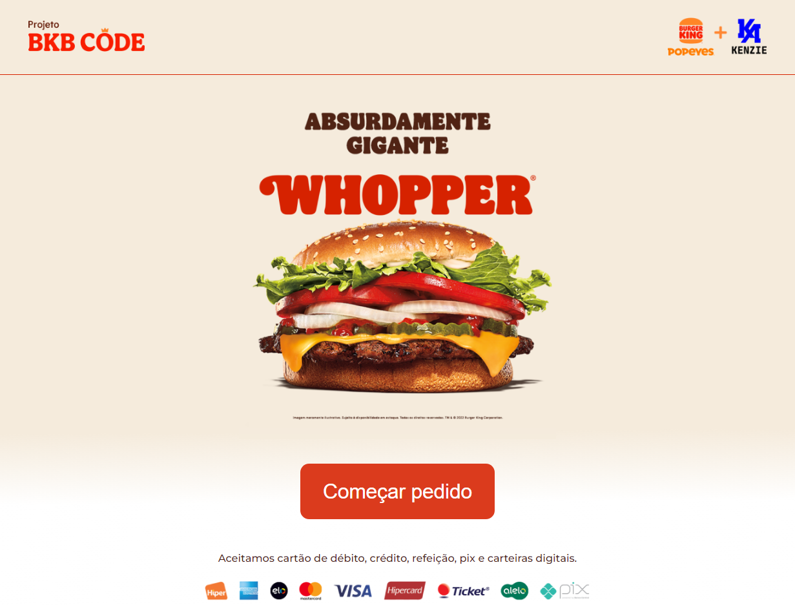
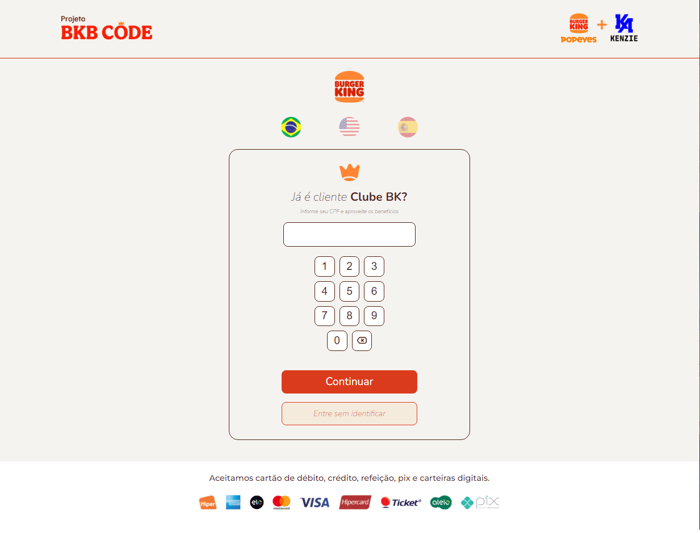
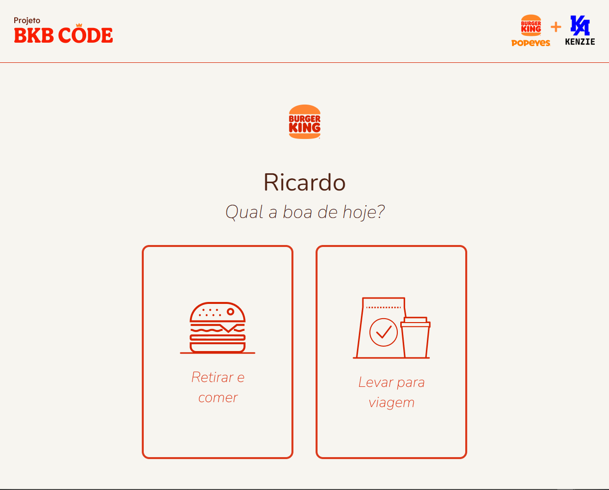

<h1 align="center">Projeto BKB - Kenzie</h1>

Projeto desenvolvido para o evento Projeto Burger Kingministrado pelos instrutores da Kenzie Academy Brasil em parceria com o Burger King.

## Layouts do projeto 🖼️:

## Linguagens utilizadas 🛠️:

    
    
           

## Autor 👨‍🎨:
Ricardo Lima | Aspirante a desenvolvedor

     
     

